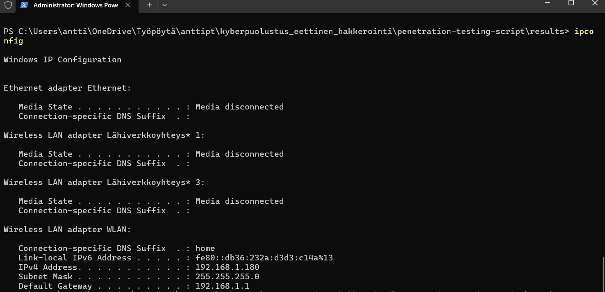

## 🎯 Tavoite

Automaattinen skripti, joka:

Skannaa kohdepalvelimen portit ja palvelut (Nmap)

Etsii tunnettuja haavoittuvuuksia web-palvelimesta (Nikto)

Testaa HTTP-pyyntöjä ja haavoittuvuuksia (Burp Suite API)

Vie hiiri kuvien päälle saadaksesi lisätietoja.

## Nmap-skannaus

```
cd penetration-testing-script
python nmap_scan.py

```



